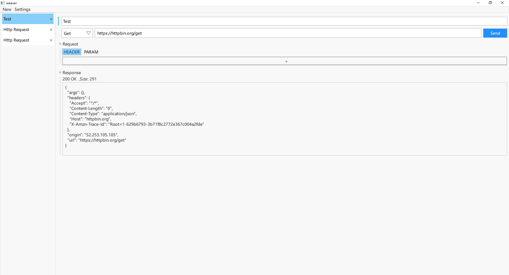

<h1 align="center" style="margin: 30px 0 30px; font-weight: bold;">WEAVER</h1>

### About
Weaver is a simple,easy-to-use and cross-platform API tool.Inspired by [hoppscotch](https://github.com/hoppscotch/hoppscotch) .
It uses the Rust [egui](https://github.com/emilk/egui/) GUI library.

### Features

- `Get`,`Post` and other method request
- `application/json`,`multipart/form-data` and more `content-type`
- Custom request header

### UI

<div align=center>
    
</div>

More screenshot in [here](https://github.com/willser/weaver/tree/master/resources/)

### Todo

There are something need to do I can be sure now.

- Better UI and style
- Icon
- Default language font

### Contributing

If you run into any problems feel free to create an [issue](https://github.com/willser/weaver/issues). 
PRs are much appreciated.
Here's a list of [good first issues](https://github.com/willser/weaver/issues?q=is%3Aissue+is%3Aopen+label%3A%22good+first+issue%22).

#### Development flow
[Install](https://www.rust-lang.org/) or update `rust`
```shell
rustup update
```

As much as possible run following these steps:
```shell
cargo fmt
cargo clippy
```
There are no `ci checks` yet,so this is an optional,I will do this before merge for now.If you have good idea,please create an [issue](https://github.com/willser/weaver/issues) 
or create a `PR`.

#### Commit and pull requests
For now,there are no format for commit messages,it's ok that the submitted code can be clearly described.

Once your pull request is approved, please merge it following these steps:
```shell
git checkout master
git pull master
git rebase master my/branch
git push -f
git checkout master
git merge my/branch
git push
```
Trying to avoid merge commits please.
